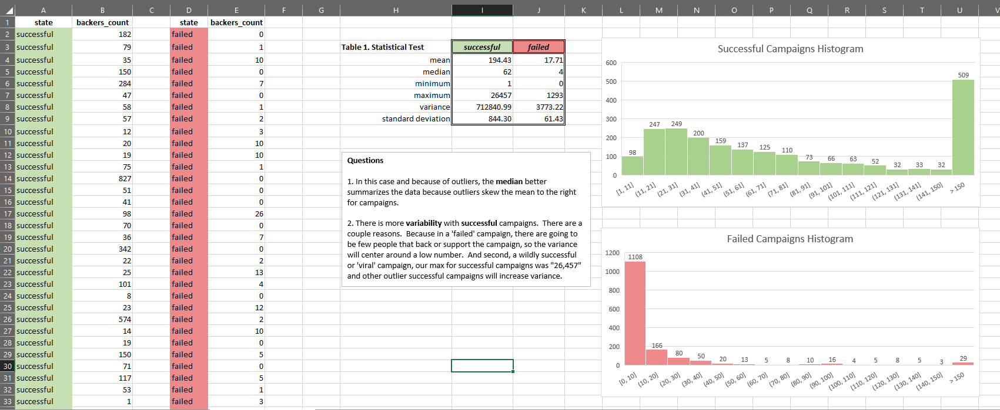

# Excel Challenge: Kickstart My Chart
by Kurt Pessa

## Initial Steps
1. Created new space `excel-challenge` in Google Drive.
2. Stored `excel-challenge.xlsx` and `excel-challenge.docx` in folder with shareable link at  `https://github.com/kpessa/excel-challenge`

### Section 1 - Manipulating Data
1. Used conditional formatting to color different cells based on `state` column. 

2. Created a new `column O`  called `Percent Funded` to determine how much money a campaign made to reach its initial goal. 
 
	- Used conditional formatting to fill each cells using a three-color scale. 

3. Created a new `column P` called `Average Donation` using a formula to uncover how much each backer for the project paid on average.	

4. Created a new `column Q` named `Sub-Category`, which used a split-like excel-functions `=LEFT()` and `=RIGHT()` to split the `Category and Sub-Category` into two parts.

### Section 2 - PivotTable1
1. Created a pivot table in a new sheet that counted how many campaigns were successful, failed, canceled or currently live per **category**.
2. Created a stacked column pivot chart that can be filtered by `country`

### Section 3 - PivotTable2
1. Created a pivot table in a new sheet that counted how many campaigns were successful, failed, canceled or currently live per **sub-category**.
2. Created a stacked column pivot chart that can be filtered by `country` and `parent-category`

### Section 4 - Converting Unix timestamps to Excel-readable date objects
1. Created two new columns `Date Created Conversion` and `Date Ended Conversion` from `launched_at` and `deadline`.
2. Converted unix timestamps to excel-readable date objects using formula below.

3. Created another pivot table / pivot chart with column of `state`, rows of `Date Created Conversion`, values based on the count of `state`, and filters based on `parent-category` and `Years`

### Section 5 - Microsoft Word Report
created `excel-challenge.docx` to answer the following questions:
 
1. Given the provided data, what are three conclusions we can draw about Kickstarter campaigns?
2. What are some limitations of this dataset?
3. What are some other possible tables and/or graphs that we could create?

### Section 6 - Bonus

- created a new sheet with 
	- 8 columns:
		- `Goal`, `Number Successful`, `Number Failed`, `Number Canceled`, `Total Projects`, `Percentage Successful`, `Percentage Failed`, `Percentage Canceled`
	- and 12 headers: 
		- `Less than 1000`, `1000 to 4999`, `5000 to 9999`, `10000 to 14999`, `15000 to 19999`, `20000 to 24999`, `25000 to 29999`, `30000 to 34999`, `35000 to 39999`, `40000 to 44999`, `45000 to 49999`, `Greater than or equal to 50000`

  

1. Used `=COUNTIFS()` formula to count how many were successful, failed, or canceled from data set.
2. Added up number of successful, failed, or canceled projects to get `Total Projects`
3. Divided numbers by `Total Projects` to get percentage successful, failed, or canceled
3. Created a line graph to show the relationship between a goal's amount and chances at success, failure, or cancellation

### Section 7 - Bonus Statistical Analysis
1. Created a new sheet with two columns
	1. One for `successful` campaigns
	2. Second for `failed` campaigns
3. Used `Name Manager` to name ranges `successful` and `failed` respectively
4. Used excel to evaluate the following statistical tests
	1. `mean` = `=AVERAGE(successful|failed)`
	2. `median` = `=MEDIAN(successful|failed)`
	3. `minimum` = `=MIN(successful|failed)`
	4. `maximum` = `=MAX(successful|failed)`
	5. `variance` = `=VAR.P(successful|failed)`
	6. `standard deviation` = `=STDEV.P(successful|failed)`
7. Answered questions about whether or not mean or median better summarized data and which, failed or successful campagins had higher variability.
	1. Wrote that the **median** better summarized data because of the effect of outliers on mean.
	2. Wrote that there was more variability with successful campaigns because wildy-successful or viral campaigns could greatly increase the variability.  And, that also, the failed campaigned centered around low numbers because there were not many people willing to back their projects.

